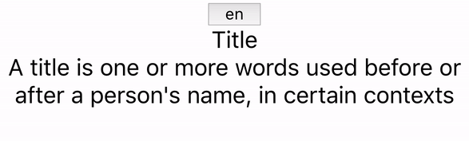

# react-easy-localization

A simple module build on top of [react-localization](https://www.npmjs.com/package/react-localization) which makes React localization easy



## Installation

`npm install --save react-easy-localization`

## API

- LocaleProvider - use React Context to provide localization values
- useLocale() - a React Hooks to get localization values
- withLocale(Component) - a React HOC to get localization values

### Localization values

- `i18n`: all localized texts
- `languageCode`: the current selected language code
- `changeLanguage`: a function to change the language

### Input

- `resources`: a simple object containing language keys (i.e. en, ge, fr..) and a list of key-value pairs for localized strings

```js
const resources = {
  en: {
    title: "Title",
    text:
      "A title is one or more words used before or after a person's name, in certain contexts",
  },
  ja: {
    title: "題名",
    text:
      "タイトルは、特定のコンテキストで、人の名前の前後に使用される1つ以上の単語です",
  },
};
```

## Usage

1. Wrap LocaleProvider on top of your application and provide resources object

```js
// on top of your app
import { LocaleProvider } from "react-easy-localization";

const App = () => (
  <LocaleProvider resources={resources}>
    <YourApp />
  </LocaleProvider>
);
```

2. Then use `useLocale` or `withLocale` to get localization values

```js
import { useLocale } from "react-easy-localization";

const Home = () => {
  const { i18n, languageCode, changeLanguage } = useLocale();

  return (
    <>
      {/* A simple button to switch the language */}
      <button
        onClick={() =>
          languageCode === "en" ? changeLanguage("ja") : changeLanguage("en")
        }
      >
        {languageCode}
      </button>

      {/* Use localized texts */}
      <div>{i18n.title}</div>
      <div>{i18n.text}</div>
    </>
  );
};

export default Home;
```

```js
import { withLocale } from "react-easy-localization";

const Home = ({ i18n, languageCode, changeLanguage }) => {
  return (
    <>
      {/* A simple button to switch the language */}
      <button
        onClick={() =>
          languageCode === "en" ? changeLanguage("ja") : changeLanguage("en")
        }
      >
        {languageCode}
      </button>

      {/* Use localized texts */}
      <div>{i18n.title}</div>
      <div>{i18n.text}</div>
    </>
  );
};

export default withLocale(Home);
```
